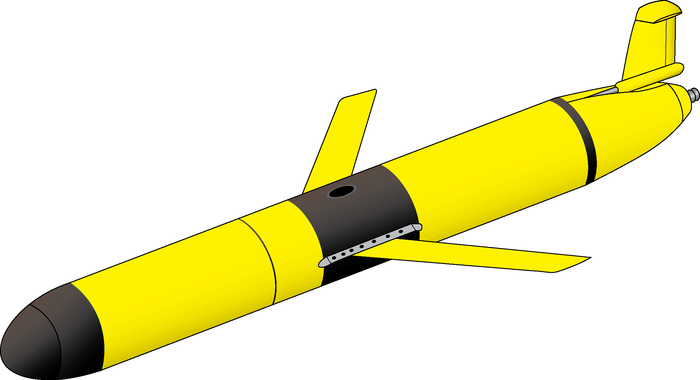

<a href="https://github.com/zduguid">
    
</a>


# Slocum Glider Battery System  

The Slocum Glider is an autonomous underwater vehicle (AUV) that is specialized for long range research scenarios. In order to maximize the achievable range of the glider, it is essential to maximize the total power capacity contained within the vehicle. To do this, the old battery system that consisted of non-rechargeable Alkaline C cells has been replaced with a new system consisting of rechargeable Lithium Ion cells. The new Lithium Ion batteries are lighter and more powerful compared to their Alkaline counterparts. In order to monitor battery performance, I created a graphical user interface (GUI) that interacts with the battery packs and displays their various state variables. The GUI is contained within the ```battery_gui.py``` script. Next, in order to model the achievable range of the glider, I created a model that graphically displays the achievable range of the glider given the total glider capacity and starting location. The model also accounts for ocean currents, but this is done using a very crude assumption. The model is contained in the ```glider_range.py``` script. 


## Table of Contents

- [Getting Started](#getting-started)
    - [Prerequisites](#prerequisites)
    - [Slocum Glider Overview](#slocum-glider-overview) 
    - [Other Helpful Commands and Links](#other-helpful-commands-and-links)
- [Battery System GUI](#battery-system-gui)
- [Glider Range Model](#glider-range)
- [References](#references)


## Getting Started

The Battery GUI can be operated from any computer given that the appropriate dependencies are satisfied. The GUI expects to receive data from a Serial interface. For computers such as the MacBook Pro or Raspberry Pi 2, there is not a native serial port available on the computers. To solve this, you can use a serial-to-usb converter. Also, for the glider range model, several packages are used in order to create various graphs. For detailed dependency specifications, please see the [Prerequisites](#prerequisites) section below. 


### Prerequisites 

* All scripts in this repository are written in ```Python3```, [Python3 Download](https://www.python.org/downloads/)
* ```PySerial``` is used to interact with the Serial interface, [PySerial](https://pythonhosted.org/pyserial/)
* ```matplotlib``` is used to create various plots, [matplotlib](https://matplotlib.org)
* ```tkinter``` is used to creat GUI widgets, [tkinter](https://docs.python.org/3.6/library/tkinter.html)
* ```numpy``` is used to create array objects for graphing, [numpy](http://www.numpy.org)
* ```Basemap``` works with ```matplotlib``` to create world map graphs, [Basemap](https://matplotlib.org/basemap/)
* ```PyProj``` is a necessary dependency for ```Basemap```, [PyProj](https://pypi.python.org/pypi/pyproj?)
* ```Time``` and ```DateTime``` modules are used to store temporal data 
* ```sys``` and ```glob``` modules are used to search avaible computer ports. For this, you must determine how your computer locates usb ports within its internal directory. For example, MacBook Pro uses ```'/dev/cu.usbserial'``` and Raspberry Pi 2 uses ```'/dev/ttyUSB0'```
* ```warnings``` is used to handle ```GUI Implemented``` errors 


### Other Helpful Commands and Links 

This command allows you to interact with the serial port of your computer via a terminal window (Note: must have ```PySerial``` installed):
```python -m serial.tools.miniterm /dev/cu.usbseriasl```

This command lists the available serial ports on your computer: 
```python -m serial.tools.list_ports```

This command is an example of how to download a module (in this case, ```matplotlib```) using ```Python3```:
```python3 -m pip install matplotlib -v```

This is the operating system that I have installed on the Raspberry Pi 2:
```2017-04-10-raspbian-jessie.img```

This command (run in Raspberry Pi terminal) gives you the system information of the Raspberry Pi:
```cat /etc/os-release```

[Dataplicity](https://www.dataplicity.com) is the website I use to control the Raspberry Pi 2 from my MacBook Pro via a Virtual Network Connection (VNC). ([XRDP](http://www.xrdp.org) also seems like a good option for those using a Window machine)

[noVNC](https://github.com/novnc/noVNC) is used in conjunction with ```Dataplicity``` to connect with the Raspberry Pi 2 from MacBook Pro


### Slocum Glider Overview

SAIL Interface 
Block Diagram
Slocum Diagram 
Hybrid Engine feature

```
Give examples
```


## Battery System GUI

#### ```battery_gui.py ```

### Examples


## Glider Range Model

#### ```glider_range.py```

### Examples


## Author

* **Zach Duguid** - [zacharysupertramp](https://github.com/zduguid)

## References
* Woods Hole Oceanagraphic Institution (WHOI)
* National Science Foundation (NSF)
* Deep Submergence Laboratory at WHOI
* Project Supervisor: Rich Camilli
