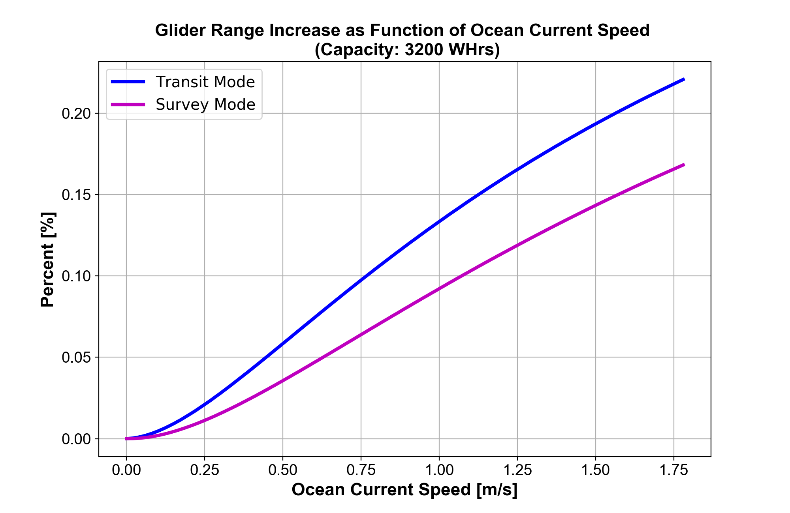

<a href="https://github.com/zduguid">
    
</a>


# Slocum Glider Battery System  

The Slocum Glider is an autonomous underwater vehicle (AUV) that is specialized for long range research scenarios. In order to maximize the achievable range of the glider, it is essential to maximize the total power capacity contained within the vehicle. To do this, the old battery system that consisted of non-rechargeable Alkaline C cells has been replaced with a new system consisting of rechargeable Lithium Ion cells. The new Lithium Ion batteries are lighter and more powerful compared to their Alkaline counterparts. In order to monitor battery performance, I created a graphical user interface (GUI) that interacts with the battery packs and displays their various state variables. The GUI is contained within the ```battery_gui.py``` script. Next, in order to model the achievable range of the glider, I created a model that graphically displays the achievable range of the glider given the total glider capacity and starting location. The model also accounts for ocean currents, but this is done using a very crude assumption. The model is contained in the ```glider_range.py``` script. 


## Table of Contents

- [Getting Started](#getting-started)
    - [Dependencies](#dependencies)
    - [Slocum Glider Overview](#slocum-glider-overview) 
    - [Other Helpful Commands and Links](#other-helpful-commands-and-links)
- [Battery System GUI](#battery-system-gui)
- [Glider Range Model](#glider-range)
- [Acknowledgements](#acknowledgements)


## Getting Started

The Battery GUI can be operated from any computer given that the appropriate dependencies are satisfied. The GUI expects to receive data from a Serial interface. For computers such as the MacBook Pro or Raspberry Pi 2, there is not a native serial port available on the computers. To solve this, you can use a serial-to-usb converter. Also, for the glider range model, several packages are used in order to create various graphs. For detailed dependency specifications, please see the [Dependencies](#dependencies) section below. 


### Dependencies 

* All scripts in this repository are written in ```Python3``` [(Python3 Download)](https://www.python.org/downloads/)
* ```PySerial``` is used to interact with the Serial interface [(PySerial)](https://pythonhosted.org/pyserial/)
* ```matplotlib``` is used to create various plots [(matplotlib)](https://matplotlib.org)
* ```tkinter``` is used to creat GUI widgets [(tkinter)](https://docs.python.org/3.6/library/tkinter.html)
* ```numpy``` is used to create array objects for graphing [(numpy)](http://www.numpy.org)
* ```Basemap``` works with ```matplotlib``` to create world map graphs [(Basemap)](https://matplotlib.org/basemap/)
* ```PyProj``` is a necessary dependency for ```Basemap``` [(PyProj)](https://pypi.python.org/pypi/pyproj?)
* ```Time``` and ```DateTime``` modules are used to store temporal data 
* ```sys``` and ```glob``` modules are used to search available computer ports. For this, you must determine how your computer locates usb ports within its directory system. For example, MacBook Pro uses ```'/dev/cu.usbserial'``` and Raspberry Pi 2 uses ```'/dev/ttyUSB0'```
* ```warnings``` is used to handle GUI Implemented errors 


### Slocum Glider Overview


There are four distinct battery packs on the glider: pitch pack, payload pack, aft-short pack, and aft-long pack. Communication with the battery packs occurs via a SAIL bus, which uses the SAIL interface. Using the SAIL interface, the pitch pack is addressed using ```#bat4```, the payload pack is addressed using ```#bat1```, the aft-short pack is addressed using ```#bat3```, and the aft-long pack is addressed using ```#bat2```. In our test configuration, the power supply is addressed using ```#ada```. This addresses are utilized in the ```battery_gui``` script in order to communicate with the desired battery pack or power supply. The full test configuration can be seen in the diagram below. 


### Other Helpful Commands and Links 

* ```python -m serial.tools.miniterm /dev/cu.usbseriasl```

    * This command allows you to interact with the serial port of your computer via a terminal window (Note: must have ```PySerial``` installed)

* ```python -m serial.tools.list_ports```

    * This command lists the available serial ports on your computer

* ```python3 -m pip install matplotlib -v```

    * This command is an example of how to download a module (in this case, ```matplotlib```) using ```Python3```

* ```2017-04-10-raspbian-jessie.img```

    * This is the operating system that I have installed on the Raspberry Pi 2

* ```cat /etc/os-release```

    * This command (run in Raspberry Pi terminal) gives you the system information of the Raspberry Pi


* [Dataplicity](https://www.dataplicity.com) is the website I use to control the Raspberry Pi 2 from my MacBook Pro via a Virtual Network Connection (VNC). ([XRDP](http://www.xrdp.org) also seems like a good option for those using a Window machine)

* [noVNC](https://github.com/novnc/noVNC) is used in conjunction with ```Dataplicity``` to connect with the Raspberry Pi 2 from MacBook Pro

* [SAIL](http://ieeexplore.ieee.org/document/1151685/) is the standard or protocol that allows for information transfer between the battery pack system and your computer 


## Battery System GUI

#### ```battery_gui.py ```

The Battery System GUI allows for interaction between your computer and the battery pack system of the Slocum Glider via the SAIL interface. The following image displays the default GUI window when the ```battery_gui.py``` script is executed: 


Each frame within the main GUI window provides distinct options for the user. Once the user selects their desired input within each frame, they must then select the Execute button within the same frame in order to the command to be sent to the SAIL bus. Below the four main frames, the user has access to three buttons. The Recharge Off button will immediately set the Power Supply current and voltage to zero, the Close button will terminate the GUI window, and the Connect to Serial Bus button will establish a connection with the serial port provided that their is a serial port available. 

* In the Power Supply frame, the user may command a desired current and voltage for the Power Supply, as well as specify the desired load. This allows the user to specify the charge and discharge situations of the battery packs, respectively. In my case, Load 1 and Load 2 are each ~7.5 Ohm resistors used to discharge the batteries 

* In the Battery Pack frame, the user may command a desired scan time for the batteries. The scan time refers to how often the batteries check and report their own battery state. The Battery Pack frame also allows the user to adjust the relays of specific batteries within each battery pack

* In the Graph Options frame, the user may command a desired set of battery packs and a desired set of battery state variables to plot graphically. The x-axis of all plots are in units of UTC time using the ```datetime.datetime.utcnow()``` function 

* In the Terminal Options frame, the user may command a desired set of battery packs and a desired set of battery state variables to print directly to a terminal window

The GUI has been designed in such a way to account for common fault modes. The following fault handling methods are currently present in the GUI:

* The user cannot connect to a serial bus if no serial bus is available

* The user cannot click any Execute button or the Recharge Off button if the GUI is not connected to a serial bus

* The user cannot click the Graph Options or Terminal Options Execute buttons without first selecting a desired scan time in the Battery Pack frame

* The user cannot click the Graph Options or Terminal Options Execute buttons without first selecting at least one battery pack and at least one state variable within the respective frame

* If the user turns on one or two loads, the voltage and current values will be set to zero. This is to prevent charge and discharge behavior to occur at the same time 


## Glider Range Model

#### ```glider_range.py```

The Glider Range Model calculates the achievable range of the Slocum Glider given the total battery capacity, the hotel load, and the ocean currents. Currently, the total battery capacity is set to the theoretical maximum value of 3200 Whrs, as determined by our specific choice of battery. In this context, 'hotel load' refers to all non-propulsive power systems on the glider. Currently, the model contains two distinct hotel load scenarios: a low power survey mode and a high power survey mode. The ocean currents are crudely modeled as a constant vector field. Although this is a crude estimate, it provides us with meaningful baseline range estimates. 1.78 m/s is the NOAA-reported average speed of the Gulf Stream. 

In order to calculate the achievable range, the model utilizes the power-speed relation that stems directly from the drag equations and efficiency data of the glider. Effectively, using the total capacity available, this allows us to plot the vehicle speed vs. the achievable range of the glider, and thus determine the optimum glider velocity. One of the major findings during the creation of this model is that the optimum glider velocity not only depends on hotel load scenario, but the optimum glider velocity also depends on the ocean current scenario. 

The user has the ability to toggle on and off the following plots by adding their plot name to the ``` model.plot_set``` object: 

* ```"speed-range"```


* ```"3d-transit-range"```


* ```"3d-survey-range"```


* ```"current-range"```


* ```"current-increase"```




* ```"current-speed"```


* ```"current-power"```


* ```"map"```


## Author

* **Zach Duguid** - [zacharysupertramp](https://github.com/zduguid)

## Acknowledgements
* Woods Hole Oceanagraphic Institution (WHOI)
* National Science Foundation (NSF)
* Deep Submergence Laboratory, WHOI
* Project Supervisor: Rich Camilli
